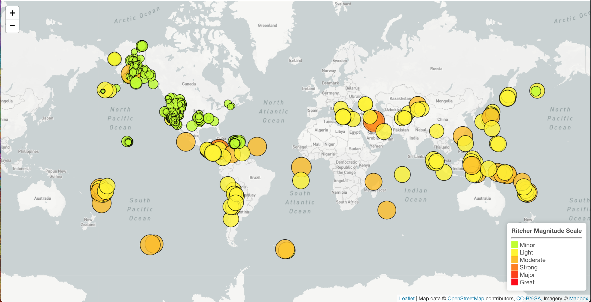
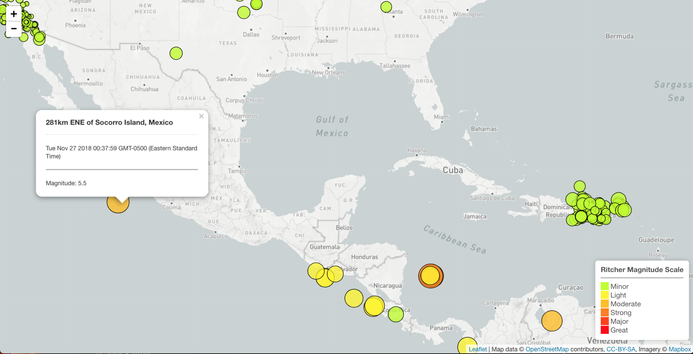

## USGS Earthquake Map

This project provides a near-live feed of global earthquakes and their relative magnitudes using data from United States Geological Survey. The end result is an interactive visualization of recent earthquakes using Leaflet.js. 

**The Dataset**

   

   The USGS provides earthquake data in a number of different formats, updated every 5 minutes. This project uses 'All Earthquakes from the Past 7 Days' from the [USGS GeoJSON Feed](http://earthquake.usgs.gov/earthquakes/feed/v1.0/geojson.php). The data is provide in JSON form and is accessed through a URL. 

   

**Visualizing the Data**

   Leaflet was used to plot a map of all the earthquakes from the data set based on their longitude and latitude.

   * Data markers reflect the magnitude of the earthquake in their size and color. Earthquakes with higher magnitudes appear larger and darker in color.

   * Popups that provide additional information about the earthquake when a marker is clicked.

   * The legend categorizes the earthquakes by the Ritcher Magnitude Scale.

   

